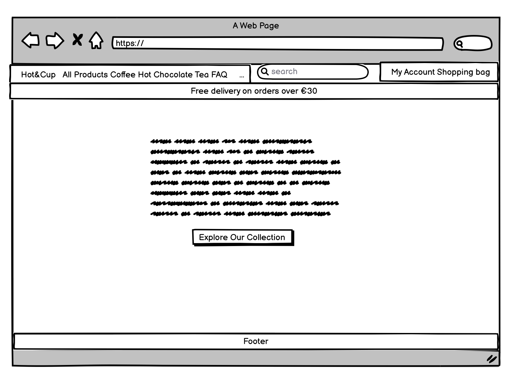
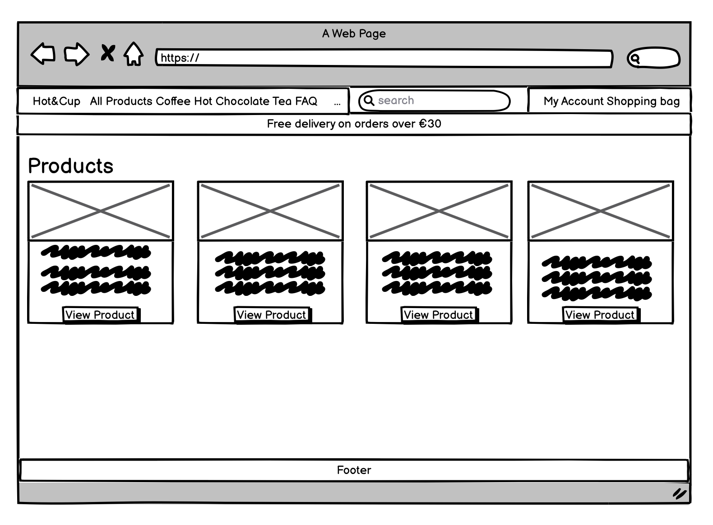
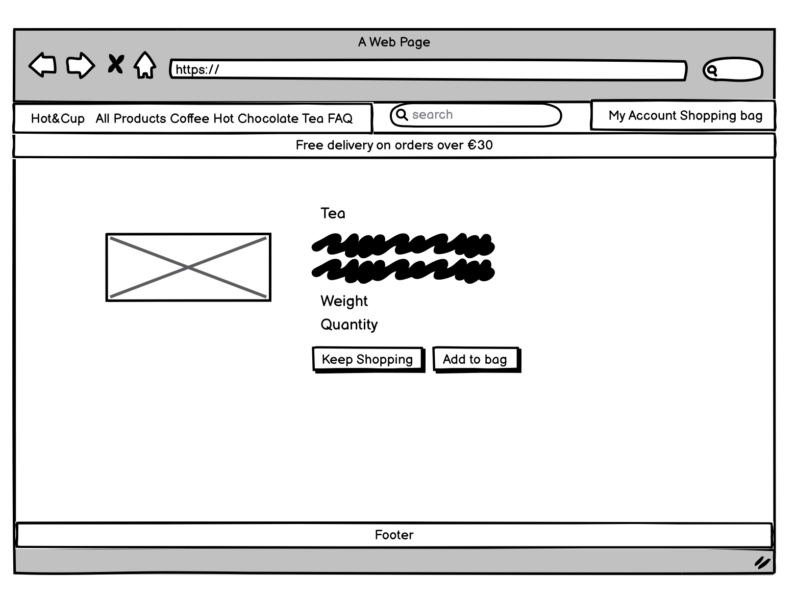
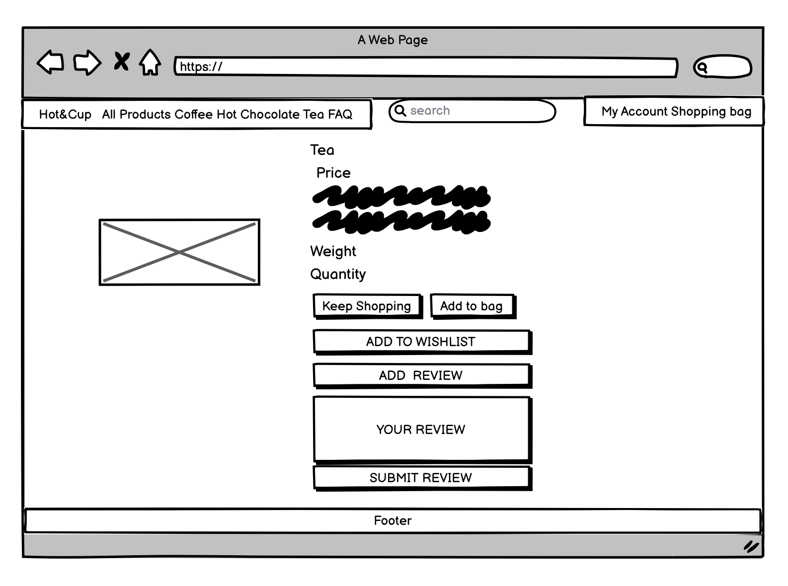
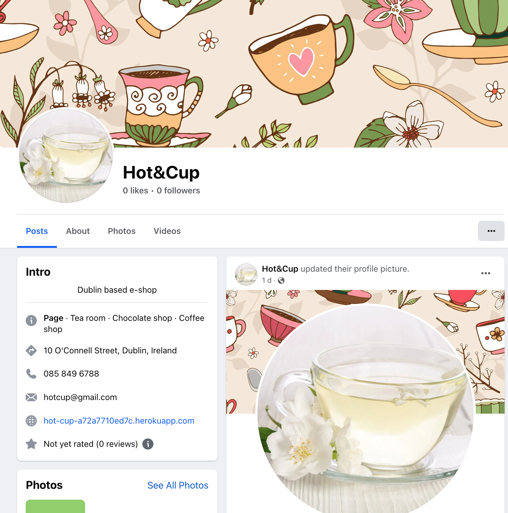
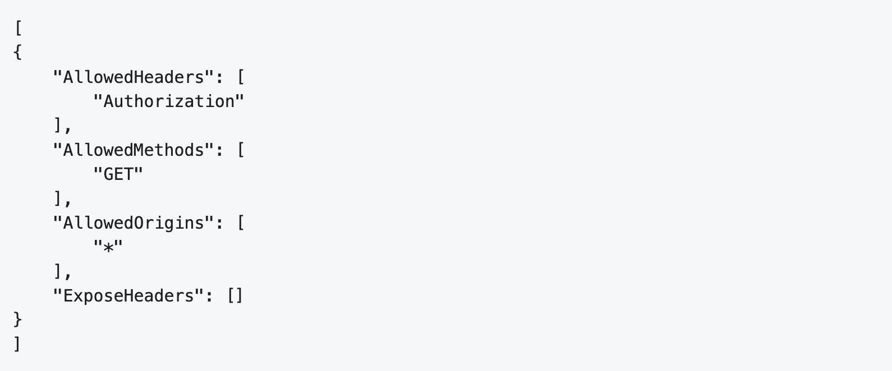
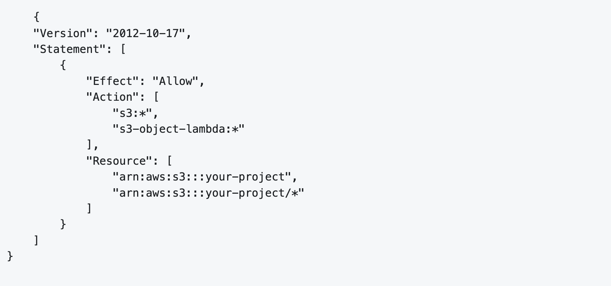

## Introduction
Hot&Cup is a web platform designed and built to serve as an e-commerce store (Business-to-Consumer) offering customers a selection of tea, coffee, and chocolate. The site used Django, Python, HTML, JavaScript and CSS, incorporating Amazon S3 and Stripe. [Link to deployed site](https://hot-cup-a72a7710ed7c.herokuapp.com/)

The target audience for Hot&Cup encompasses anyone with a fondness for coffee, tea, and hot chocolate. This broad demographic includes individuals across various age groups, lifestyles, and preferences who share a common appreciation for these delights. Whether someone enjoys a morning ritual with a fresh cup of coffee, relishes the calming effect of tea in the afternoon, or indulges in the rich flavors of a hot chocolate as a treat, Hot&Cup aims to cater to their needs. This inclusive approach ensures that the platform offers something for every enthusiast out there, making it a go-to destination for consumers seeking quality, variety, and the simple joy found in these universally beloved beverages and treats.

## Features
### Navbar
The Navbar prominently displays the site name Hot&Cup on the far-left, doubling as a link to the homepage. At the left there are links for 'All Products', 'Coffee', 'Hot Chocolate', and 'Tea'. The link for frequently asked questions (FAQ) and search tool is placed centrally.  Situated on the right are accessible links to 'Register', 'Login', "Wishlist' (if logged in), and the 'Shopping Bag'. Additionally, a banner is featured, informing users of the €30 minimum purchase necessary to qualify for free delivery. The Navbar is fully Responsive and switches to hamburger menu on small screens.

### Homepage
The homepage incorporates a background image of tea cups with a central plate with welcome message and product introduction.

### Footer
The footer contains links to stores Facebook and Instagram page. There is also links for 'Homepage', 'All products' and 'FAQ'. The contact details are also provided. A feature for newsletter subscription utilizing Mailchimp is available.

### Register
The registration page on Hot&Cup facilitates a smooth sign-up process for new customers. It features a clean layout where users can input their email, a chosen username and password. The page requires users to enter their email and password twice for verification purposes to prevent typing errors.

### Profile
The user is invited to enter user name, phone number, street address, town or city, county, postcode and country

### Login
The login page offers existing users a secure and straightforward method to access their accounts. With an emphasis on user experience, the login process is optimized for efficiency, ensuring customers can swiftly proceed to browsing and purchasing.

### Products Page
The Products Page of Hot&Cup serves as a visual showcase of the various beverages available for purchase. Each product is presented in a card-like format, displaying a image. Alongside the image, the product name and price are displayed. 

Below the name and price there is a brief description of the product. This snippet of text is designed to entice the user by providing just enough information to pique their interest without overwhelming them with details.

A prominent 'View Product' button is placed beneath each description, inviting users to learn more about the item.

### Product Detail and Reviews
The Product Details Page showcases the product image and essential information for the selected item. The product name and price is immediately visible, and a succinct description is provided.

Customers can select the product weight from a dropdown menu and also adjust the desired quantity. When logged in prominent 'Add to Bag' and 'Keep Shopping' buttons facilitate the purchasing process, while an 'Add to Wishlist' option allows for future purchases.

When logged in there is also the option to post and read reviews. These reviews help customers make informed decisions and contribute to the platform's trustworthiness.

The page's design ensures a smooth and efficient shopping experience, aligned with Hot&Cup's brand and user experience standards.

### Shopping Cart
The Shopping Bag page presents a clear summary of the customer's selected items for purchase. It displays product details such as an image, name, price, quantity, subtotal, delivery charges and grand total. An option to remove items is readily accessible. It also informs customers how much more they need to spend to qualify for free delivery, encouraging additional purchases. If not logged in the user can complete checkout and is instead presented with'Login to Checkout','Sign up'and 'Keep Shopping' buttons. A registered logged in user is presented with a 'Secure Checkout' button to complete purchase. A 'Keep Shopping' option allows users to continue browsing.

### My Wishlist
When logged in the user has the option to add and remove products on a wishlist for future purchases.

### Checkout
The checkout process is streamlined for efficiency, with clear steps and secure payment options. Integration with Stripe allows for a choice of payment methods, ensuring a smooth transaction process.

### FAQ Page
The FAQ section on Hot&Cup is designed to address common customer inquiries and provide helpful information about product storage, origins, return policies, and shipping times.

## Design

### Colour Scheme

The website has a simple, elegant look that feels cozy and stylish at the same time. I use a mix of down-to-earth and soft, calming colors to make our visitors feel welcome and at ease. I keep the colors consistent throughout the site:

- Navbar background: light gray .bg-light
- Banner: black .bg-black
- Central panel homepage: blue .bg-info
- Buttons: grey .btn-secondary
- Footer background: grey #D3D3D3
- Principle text: white #fff, orange-brown #D2691E, grey #0000008c

The chosen color palette aims to create an engaging and visually pleasing browsing environment.

### Wireframe mock-ups

[Balsamiq](https://balsamiq.com/) was used to design the wireframes for my website.

### Database Schema

The database schemas were designed using [Lucid App](https://lucid.app/). These schemas were pivotal in planning the database models and defining their respective fields. They also facilitated visualizing the relationships between the models and their interactions. 

## UX
Our e-commerce community, Hot&Cup, is dedicated to providing a seamless shopping experience for tea, coffee, and hot chocolate enthusiasts. Our goal is to offer a user-friendly platform where our customers can easily find and purchase their favorite beverages. With a clean and inviting design, we ensure our customers can navigate through our product offerings with ease, making their shopping experience enjoyable and straightforward.

We are aimed at: 
- individuals who appreciate the finer details of teas, coffees, and hot chocolates and are looking to purchase these products online.
- customers who are interested in exploring a variety of flavors and brands from the comfort of their home.
- shoppers looking for a convenient and secure way to buy their favorite hot beverages.

We aim for: 
- providing a diverse range of high-quality tea, coffee, and hot chocolate products for our customers to choose from.
- offering a platform that not only sells beverages but also educates and informs customers about the different products available.
- creating an engaging online space where customers can read and share reviews, and have their questions answered through a comprehensive FAQ section.

## Agile Development
The project adopts the Agile Methodology using GitHub for meticulous planning and efficient execution. User Stories are clearly defined as GitHub issues, delineating their objectives and expected outcomes.

Furthermore, the project is structured into 5 Epics which are broken down into detailed User Stories. Each story is allocated story points reflecting its complexity. The specifics of each epic and the related user stories are systematically organized within the project's [kanban board](https://github.com/users/nataliatesarova/projects/17) 

## Epics and User Stories

The project consists of the following Epics and User Stories, employing the MoSCoW method to prioritize tasks.

### EPIC 1: Viewing items to shop

1. As a user I can visit the home page so that I can identify the purpose of the website ‘Must Have’
2. As a user I can view the products so that I can choose what to buy ‘Must Have’
3. As a user I can search and filter products by category so that I can focus on items that interest me ‘Should Have’
4. As a user I can post and read reviews so that I can provide and receive valuable insights and opinions on products ‘Could Have’
5. As a user I can access detailed information about each product so that I can make an informed purchase decision ‘Must Have’
6. As a user I can access a list of frequently asked questions so that I can find quick answers to common queries without needing to contact support ‘Could Have’

### EPIC 2: User profile

1. As a user I can register for an account so that I can shop on the website ‘Must Have’
2. As a user I can log in to my account so that I can make new purchases ‘Must Have’
3. As a user I can create a new password so that I can access my account if I forget my current password ‘Must Have’
4. As a user I can have the option to subscribe to a newsletter so that I can receive the latest updates on products ‘Could Have’

### EPIC3: Shopping cart

1. As a user I can add items to a wishlist so that I can keep track of my interests for possible future purchase ‘Could Have’
2. As a user I can place products in my shopping cart so that I can review and buy several items together ‘Must Have’
3. As a user I can delete items from my shopping cart so that I can revise my final purchase choices ‘Should Have’

### EPIC 4: Payment

1. As a user I can make secure payments with Stripe so that my transactions are safe and reliable ‘Must Have’
2. As a user I can choose different payment methods such as digital wallets for my convenience ‘Should Have’

### EPIC 5: Admin

1. As admin (superuser) I can utilize the administrative panel so that I have the ability to create, update, manage, and delete products and user profiles for effective site management ‘Must Have’

## Future features

Discount Discovery: Users can quickly locate deals to save on purchases.
Best-seller Insights: Shoppers see what's trending to follow popular choices.
Personalized Browsing: Product suggestions evolve from user activity for tailored options.
Custom Alerts: Notifications for new stock or items cater to user interests.
Cart Customization: Option to modify quantity for each cart item and hold items in the cart for future purchase.
Delivery Estimates: Visible expected item delivery times for better planning.
Promo Code Application: Users can redeem codes for additional savings.
Order History: A full view of past transactions aids in budgeting and repurchases.
Sales Analytics: Admins access data on sales and customer habits for strategic adjustments.
Inventory Alerts: Automated notifications for low stock to prevent shortages.

# Testing

## Validator

HTML:

CSS:

Code Institute Python Linter:

JShint validator: was used for validation to ensure no JavaScript errors.

## Testing of user stories -->

<!-- # Bugs -->

# Technologies
## Languages

- HTML
- CSS
- JavaScript
- Python

## Frameworks and Tools

- Django: Python framework used in the project's development.
- Bootstrap: Front-end CSS framework for design consistency.
- PostgreSQL
- Balsamiq: Tool used for wireframe creation.
- LucidChart: Platform for designing the database schema.
- Font Awesome: Source for icons.
- Chrome Dev Tools: Used for development and responsive testing.
- Git: Version control through Gitpod terminal for commits and pushes to GitHub.
- GitHub: Repository for storing the project's code.
- Heroku: Platform for deploying the application.
- AWS S3: Used to store static and media files.
- Stripe: Used to handle payments.

## Search Engine Optimization SEO and Marketing

### Business Model

Hot&Cup embraces a consumer-centric online retail approach, delivering a range of quality teas, coffees, and hot chocolate. Catering to connoisseurs of these beverages, our platform ensures a smooth and intuitive shopping journey. The goal is to attract customers desiring variety, value for money, and the convenience of having their favorite items delivered to their homes.

### SEO

Sitemap and robots.txt files have been added to the site's root to help with SEO.

A sitemap, crucial for website navigation, was developed with the assistance of xml-sitemaps based on the live version of the site, and has been positioned at the top directory of the project. Furthermore, a robots.txt document has been instituted at the project's highest level to direct search engine bots regarding which website URLs are permissible for access.

### Marketing

From a marketing perspective, the website features a section for newsletter subscription, aimed at boosting user interaction and advancing the online store's visibility through strategic email marketing campaigns and a robust social media presence.

Additionally, a Facebook page has been established to further enhance our digital footprint and engage with our audience on social media platforms.

Facebook business page [Facebook](https://www.facebook.com/profile.php?id=61556575922935)

Mailchimp

## Deployment

Live Deployment: Find the application deployed on [Heroku](https://hot-cup-a72a7710ed7c.herokuapp.com/).

To deploy your application successfully on Heroku, you must first update the requirements.txt file. This file contains a list of all the packages necessary for your application to function.

To generate this list, execute the command pip3 freeze > requirements.txt. This creates or updates your requirements.txt with the current packages and versions.

After updating the requirements, commit the changes and push them to your GitHub repository.

Before pushing any code to GitHub, ensure that all sensitive credentials are stored in an env.py file and that this file is listed in your .gitignore. This prevents Git from tracking the file and stops it from being uploaded to GitHub, keeping your credentials secure.

### Stripe:

- Sign into your Stripe account.
- Head to the developers' section found at the top right.
- In the API keys area, take note of the PUBLIC_KEY and SECRET_KEY.
- Enter these keys into your env.py file.
- Go to the Webhooks section via the menu and select 'Add endpoint'.
- Provide your application's deployment link, which should resemble: https://your_website.herokuapp.com/checkout/wh/.
- Select the relevant events you want the webhook to listen for and confirm by adding the endpoint.
- After your app is live, conduct a test purchase to verify webhook functionality. Check the webhook's responses on the webhooks page.

### AWS:

- Log into your AWS account.
- To make a new S3 bucket, pick the AWS region nearest to you and give the bucket a unique name.
- In the Object Ownership settings, choose "ACLs enabled" for object access.
- In the Block Public Access settings, turn off "block all public access" since your app needs to reach the bucket contents.
- Confirm these choices and create your bucket.
- Then, adjust the bucket's settings:
- Bucket Properties: Access the bucket's properties, find the website hosting section, and hit edit. Activate static website hosting, choose "Host a static website", and put "index.html" and "error.html" in the respective fields, then save.
- Bucket Permissions: Click the "Permissions" tab, scroll to "CORS configuration", and click edit. Insert the needed code snippet and save your changes.

To set up your S3 bucket's policy and permissions, follow these steps:

- In the bucket policy section, click 'Edit'.
Note your bucket's ARN, for example, arn:aws:s3:::test-bucket.

To create a new policy:
- Open the policy generator tool.
- Choose 'S3 Bucket Policy' as the policy type.
- Set 'Effect' to 'Allow'.
- Enter * for Principal to apply the policy to all users.
- Select 'Amazon S3' as the service.
- Choose 'GetObject' as the action.
- Input your bucket's ARN.
- Add the statement and then generate the policy.
- Copy the new policy.
- Applying the policy:

Paste the policy into the bucket policy editor on AWS.
Append "/*" to your bucket's ARN in the policy to enable access to all contents.
Save the changes.
For ACL settings:

Go to the Access control list (ACL) section and click 'Edit'.
Enable 'List' for 'Everyone' to allow public access and acknowledge the warning.
If you can't edit, ensure 'ACLs enabled' is selected under 'Object Ownership' in your bucket settings.

Setting up IAM and permissions in AWS:

- Creating an IAM User Group
- Go to the IAM dashboard in AWS.
- Select "User Groups" from the left menu.
- Click "Create user group," name it, and then create it. You'll add users and set permissions later.
- Setting Up a Permissions Policy
- Navigate to "Policies" in the left menu and choose "Create policy."
- Use the "Import managed policy" option to search for "AmazonS3FullAccess." Import it.
- In the policy editor, switch to the "JSON" tab.
- Find the "Resource" section in the JSON. Replace the placeholder ARN ("") with your bucket's ARN. Include your bucket's ARN again, this time appending "/*" to allow access to all objects within the bucket.
This process creates a policy giving full access to the specified S3 bucket and prepares a user group for managing permissions effectively.

- On the next page, provide a name and description for the policy and then click 'Create Policy'.
- To link the policy to a user group, go to 'User Groups' from the sidebar menu.
- Click the name of the group you've previously set up and head over to the 'Permissions' tab.
- Choose 'Attach Policy', find the policy you just made, select it, and confirm by clicking 'Attach Policy'.
- For creating a new user, navigate to 'Users' in the sidebar and select 'Add User'.
- Type in the desired username.
- Mark the checkboxes for 'Programmatic access' and 'AWS Management Console access' and proceed to the next step.
- Add the new user to the group by clicking 'Add user to group', check the group you formed before, and finalize by clicking 'Create User'.
- Make sure to note down the 'Access key ID' and 'Secret access key' shown, as they will be required for S3 bucket connectivity.
- To keep a record of these credentials, click 'Download .csv'.

To get your project up and running on Heroku, follow these steps:

### Deployment on Heroku

- Sign up for a Heroku account.
- Once signed in, start a new app by pressing the 'Create app' button.
- Choose a distinctive name for your app, pick a server region, and then click 'Create App'.
- On your app's dashboard, go to the 'Settings' section and look for 'Config Vars'.
- Enter any sensitive information like credentials and API keys in the 'Config Vars' section to keep them secure. This project specifically requires certain credentials to be stored here.

  1. Django's secret key
  2. Database Credentials
  3. AWS access key 
  3. AWS secret key
  4. Email host password.
  5. Stripe public key
  6. stripe secret key
  7. Stripe wh secret

- Navigate to 'Buildpacks' in your app's settings. Buildpacks prepare your environment by installing additional dependencies not listed in your requirements.txt. For this project, select the Python buildpack.
- Switch to the 'Deploy' tab at the top of the page.
- Choose GitHub as the deployment method. Confirm the connection to GitHub, then locate and connect to your repository.
- In the 'Automatic Deploys' section, you have the option to enable automatic updates. This will automatically rebuild your app every time you push changes to the connected GitHub repository. Activate this if desired.
- To deploy, click the 'Deploy Branch' button. Heroku will then build your app. Once the build process is complete, you'll receive a notification indicating a successful deployment, along with a button to view your live application.

### Forking the Repository

Log in to GitHub or create an account. Go to https://github.com/nataliatesarova/Hot-Cup. Click "Fork" at the top-right of the repository. A copy will be created in your own repository.

### Cloning Repository

Visit https://github.com/nataliatesarova/Hot-Cup. Click the green "Code" button and choose "Clone by HTTPS". Copy the provided URL. In your terminal, navigate to your desired directory. Type 'git clone [copied URL]' and press enter to clone the repository locally.

## Credits and Acknowledgments

I would like to thank my mentor Rory Sheridan and all the tutors, teachers and student colleagues for help and advice on the project.